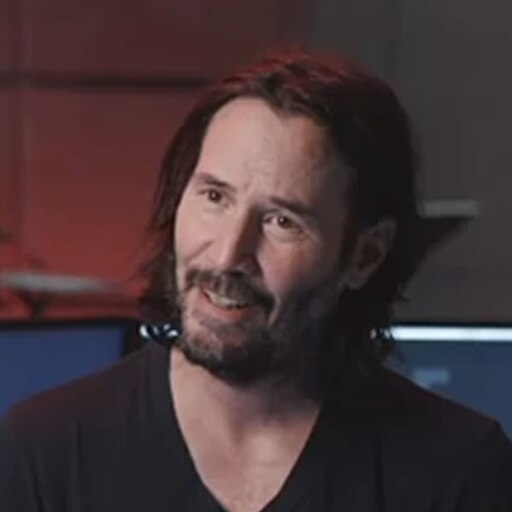

<h1 align="center">🤡 Why Do You Bot 🤡</h1>

<p align="center">
  
</p>

<p align="center">
  <a href="https://knowyourmeme.com/memes/is-extremely-horny">Is Extremely Horny</a> meme generator server for TG bot with more customization.
</p>

<p align="center">
  
</p>

<br>

## 🤔 Use

If bot is built with `db` function in groups/supergroups, you can use `/help` command to learn how to add your own images and audio.

Enjoy it 👉[here](https://t.me/who_do_you_bot) 👈

## 🔮 Deploy

1. Install [Rust](https://www.rust-lang.org/learn/get-started).

2. Clone this repository.

3. Create `.env` file with next tokens in root directory:
    ```dotenv
    TELOXIDE_TOKEN=<TG_BOT_TOKEN>
    WORDS=<COMMA_SEPARATED_TRIGGER_WORDS>
    DATABASE_URL=sqlite:<DB_FILE_NAME>.db
    LOG_FILE=<LOG_FILE_PATH>
    CONVERTER_URL=<URL_TO_CUSTOM_CONVERTER>
    ```

4. Configure database:
   ```shell
   $ cargo install sqlx-cli
   $ export DATABASE_URL="sqlite:<DB_FILE_NAME>.db"
   $ sqlx db create
   $ sqlx migrate run
   ```

5. Get dependencies with `cargo`:
    ```shell
    $ cd <path>/why_do_you_bot
    $ cargo build --features tg,db
    ```

6. Run with `cargo`:
    ```shell
    $ cargo run --features tg,db -- --debug
    ```
    *`--debug` - verbose logging flag*

## 🙈 Custom converter

You can set url to custom converter in `.env` file.
Converter needs a method that supports such a request:
```shell
curl --location --request POST 'http://<custom_url>/process' \
--form 'data=@"custom_picture.jpg"' \
--form 'audio=@"custom_music.mp3"'
```

- `data` - required image binary.
- `audio` - optional audio binary.

**Method should return a binary video.**

## 🙊 Add locales

Create `<lang_code>.locale` in `assets/locale/` with next contents:
```
// example comment

"<key>" = "<value>";
"<key>" = "<value>";
"<key>" = "<value>
";
"<key>" = "
<value>
";
"<key>" = "
<value>";

```

## 🙉 Implement new bot

You need a create new `.rs` file with bot realisation and use `build_message` from `engine.rs`. Example:
```rust
let message = "hi!"; // message from bot
let get_user_image = async move {
    return if <has user image> {
        // get user image in 'user_image'
        Some(user_image)
    } else {
        None
    };
};
let get_audio = async move {
    return if <get custom audio image> {
        Some(some_audio_vector)
    } else {
        None
    };
};
match build_message(message, get_user_image, get_audio).await {
    Ok(v_data) => match v_data {
        Video(video) => {
            // Send video with bot
            Ok(())
        }
        Image(image) => {
            // Send image with bot
            Ok(())
        }
    },
    Err(err) => {
        // Handling error (ex.: send message to user)
    }
}
```

Also need add new feature to `Cargo.toml`:
```toml
[features]
tg = ["teloxide"]
db = ["sqlx"]
my_new_bot_feature = []
```

Add new configuration statement in `main.rs`:
```rust
cfg_if::cfg_if! {
    if #[cfg(feature = "tg")] {
        async fn run() {
            use crate::bots::tg::run_tg_bot;
            run_tg_bot().await;
        }
    } else if #[cfg(feature = "my_new_bot_feature")] {
        async fn run() {
            // run await function
        }
    } else {
        async fn run() {
            println!("No selected feature");
        }
    }
}
```

---
- **License:** © 2021 M.Price.<br>See the [LICENSE file](LICENSE) for license rights and limitations (MIT).
